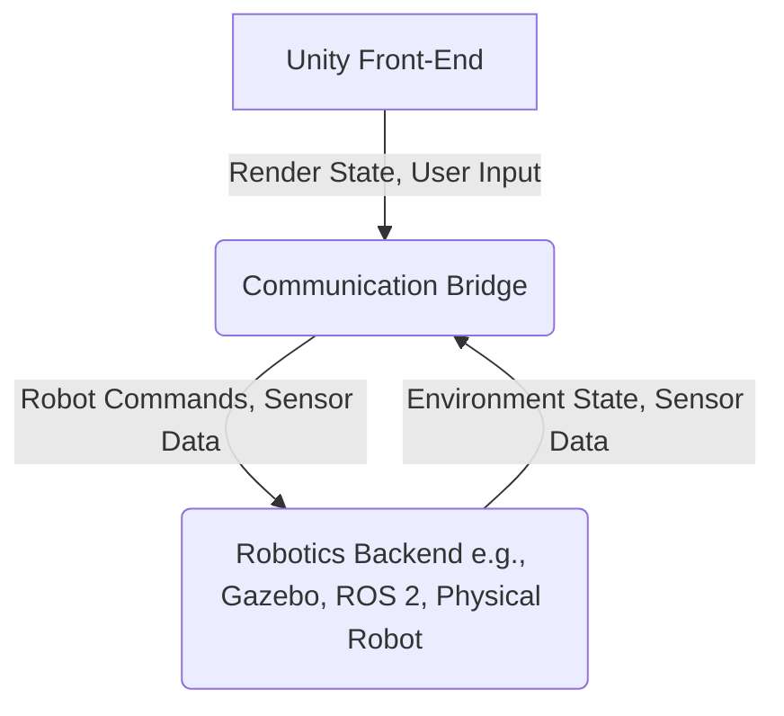

# Using Unity as a High-Fidelity Front-End

Unity's capabilities extend beyond just simulation; it can serve as a powerful and visually rich front-end for robotics applications, especially when coupled with other simulators like Gazebo or directly with physical robots via communication bridges like ROS 2. This allows for advanced visualization, intuitive control interfaces, and immersive user experiences.

## Architecture for a Unity Front-End

The typical architecture involves a communication bridge between Unity and the robotics backend (e.g., Gazebo, a ROS 2 system, or a robot controller). Unity then visualizes the state of the robot and environment, processes user input for commands, and displays sensor data.

## Key Integration Patterns

### 1. ROS-Unity Bridge (using ROS#)

ROS# (ROS-Sharp) is a set of .NET libraries for ROS communication, enabling Unity applications to act as ROS nodes. This allows direct subscription to ROS topics (e.g., sensor data, robot pose) and publishing to ROS topics (e.g., motor commands, navigation goals).

*   **Advantages**: Direct ROS 2 integration, leverages existing ROS ecosystem.
*   **Use Cases**: Teleoperation, sensor data visualization, robot control.

### 2. Custom Data Stream (e.g., TCP/UDP)

For scenarios where ROS is not suitable or a custom high-performance link is needed, Unity can communicate with a backend via custom TCP/UDP sockets or other protocols. This requires implementing both ends of the communication.

*   **Advantages**: High flexibility, optimized for specific data types.
*   **Use Cases**: High-bandwidth sensor streams, real-time control loops.

### 3. Digital Twin Synchronization

When Unity acts as a digital twin front-end for a Gazebo simulation, it often involves a two-way synchronization:

*   **Gazebo to Unity**: Gazebo sends robot pose, joint states, and environmental changes to Unity.
*   **Unity to Gazebo**: Unity sends high-level commands or parameter updates back to Gazebo.

## Example: Visualizing a Gazebo Robot in Unity

This involves:
1.  **URDF/SDF Import**: Import the robot's URDF or SDF into Unity to get its visual model.
2.  **ROS 2 Bridge**: Use `ros_gz_bridge` to send robot joint states and pose from Gazebo to ROS 2 topics.
3.  **ROS#-Unity**: In Unity, subscribe to these ROS 2 topics. Apply the received joint states and pose to the imported Unity robot model.

By following these steps, you can create a visually rich and interactive Unity front-end that accurately reflects the state of your Gazebo-simulated robot.